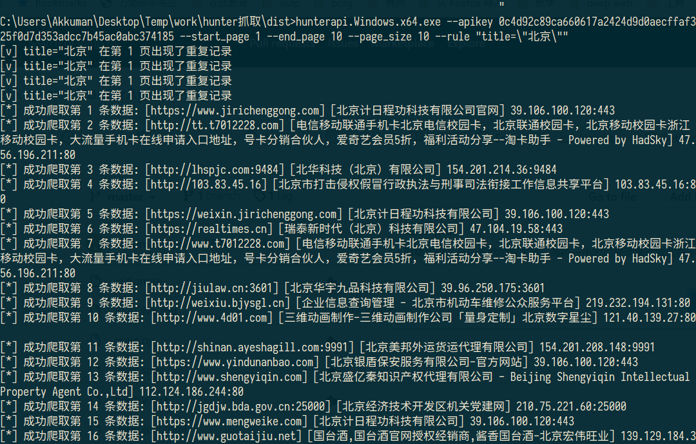

# HunterAPI

奇安信的网络空间测绘引擎 [hunter](https://hunter.qianxin.com/) 的 api 查询导出工具

写了一篇关于 [各个网络空间检索平台之间的对比](./introduce.md)

## 使用说明

```shell
git clone github.com/akkuman/HunterApi
cd HunterApi
pip install -r requirements.txt
python main.py --apikey xxxx --start_page 1 --end_page 10 --page_size 100 --rule "title=\"北京\""
```

如果是 Windows 系统可以直接到 [发布页面](https://github.com/akkuman/HunterApi/releases/latest) 进行下载使用

## 截图



## 帮助说明

```
> python main.py  -h

usage: main.py [-h] --apikey APIKEY [--start_page START_PAGE] [--end_page END_PAGE] [--page_size PAGE_SIZE] [--rule RULE] [--is-web {0,1}]

optional arguments:
  -h, --help            show this help message and exit
  --apikey APIKEY       hunter api key (default: None)
  --start_page START_PAGE
                        爬取开始页数 (default: 1)
  --end_page END_PAGE   爬取结束页数，默认为一直爬取，直至积分不够或者爬取完成 (default: None)
  --page_size PAGE_SIZE
                        每页爬取数量，最大为100 (default: 100)
  --rule RULE           搜索语法 (default: title="北京")
  --is_web {0,1}        是否为网站资产 (default: 1)
  --interval INTERVAL   每次请求api之间的时间间隔 (default: 3.0)
```

将会在同目录下生成sqlite3数据库文件，可以使用navicat、sqlitestudio等工具打开查看
